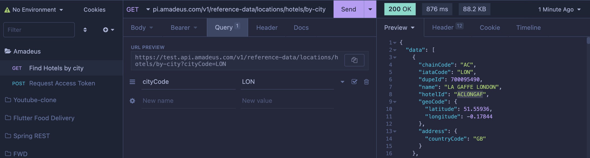

# TripToop - Travel App

<div style="justify-content: center; display: flex;">
   
</div>

## Table of Contents

- [TripToop - Travel App](#triptoop---travel-app)
  - [Table of Contents](#table-of-contents)
  - [Environment Setting ](#environment-setting-)
    - [iOS Setting ](#ios-setting-)
    - [Android Setting ](#android-setting-)
  - [Run the App ](#run-the-app-)
  - [React Navigation ](#react-navigation-)
    - [Route Architecture ](#route-architecture-)
    - [Create new screens ](#create-new-screens-)
  - [React Native Vector Icons issue ](#react-native-vector-icons-issue-)
    - [How to use React Native Vector Icons within React Native Paper ](#how-to-use-react-native-vector-icons-within-react-native-paper-)
  - [Redux ](#redux-)
    - [Create new Reducer/Slice ](#create-new-reducerslice-)
  - [AWS Amplify ](#aws-amplify-)
    - [If encounter error like "amplify" command not found, try to add path at root](#if-encounter-error-like-amplify-command-not-found-try-to-add-path-at-root)
      - [!!! Amplify init will add list of paths and files in .gitignore](#-amplify-init-will-add-list-of-paths-and-files-in-gitignore)
    - [API - AWS Amplify -\> AWS API Gateway ](#api---aws-amplify---aws-api-gateway-)
    - [API - AWS Amplify -\> AWS Lambda Function ](#api---aws-amplify---aws-lambda-function-)
    - [Deployment Tracker - AWS Amplify -\> AWS CloudFormation ](#deployment-tracker---aws-amplify---aws-cloudformation-)
    - [Logger - AWS Amplify -\> AWS CloudWatch ](#logger---aws-amplify---aws-cloudwatch-)
    - [Auth - AWS Amplify -\> AWS Cognito ](#auth---aws-amplify---aws-cognito-)
  - [Amadeus - Hotel \& Flight Booking API ](#amadeus---hotel--flight-booking-api-)
    - [API Call Sample (without Node SDK) ](#api-call-sample-without-node-sdk-)
      - [Get Access Token API (expires every 30 minutes) ](#get-access-token-api-expires-every-30-minutes-)
  - [Test Credit Card Account Numbers](#test-credit-card-account-numbers)
  - [Create App Icon](#create-app-icon)

## Environment Setting <a name="environment-setting"/>

[**React Native Official Guide**](https://reactnative.dev/docs/environment-setup)

```bash
npm install
# or
yarn install
```

### iOS Setting <a name="ios-setting"/>

```bash
brew install node
brew install watchman

# optional for M1 MacOS
sudo arch -x86_64 gem install ffi

# Ruby - MacOS 12.5.1 or up
ruby --version

# install ruby version manager
brew install rbenv ruby-build

# list latest stable versions
rbenv install -l

rbenv install 3.0.4

# override main ruby version with rbenv’s
rbenv global 3.0.4

nano ~/.zshrc
#or
nano ~/.bash_profile

# insert the following if rbenv version override failed :
export PATH="$HOME/.rbenv/bin:$PATH"
eval "$(rbenv init -)"

brew install cocoapods
cd ~/<project-root>/ios
pod install
rm -rf build
cd ../<project-root>
```

### Android Setting <a name="#android-setting"/>

1. Commands
```bash
brew install node
brew install watchman
brew tap homebrew/cask-versions
brew install --cask zulu11
```
2. [**Install Android Studio**](https://developer.android.com/studio)
With below items checked

- Android SDK
- Android SDK Platform
- Android Virtual Device

3. Install the Android SDK, Android 12 (S) works with this project, and check following items

- Android SDK Platform 31
- Intel x86 Atom_64 System Image / Google APIs Intel x86 Atom System Image

4.  Commands
```bash
nano ~/.bash_profile
# or
nano ~/.zshrc

# insert
export ANDROID_SDK_ROOT=$HOME/Library/Android/sdk
export PATH=$PATH:$ANDROID_SDK_ROOT/emulator
export PATH=$PATH:$ANDROID_SDK_ROOT/platform-tools
```

5. Create a new Android emulator for testing
https://developer.android.com/studio/run/managing-avds

---

## Run the App <a name="run-the-app"/>

```bash
# watcher mode for debug purpose, enable instant hot reload
npx react-native start


# iOS
# open another terminal
npx react-native run-ios
# or specific simulator
xcrun simctl list devices # <- find all available iOS simulators
npx react-native run-ios --simulator="iPhone 13 Pro Max"
# or plug in USB to deploy to real iPhone device, "iPhone" is the name of your device
npx react-native run-ios --device "iPhone"


# Android
# open another terminal
npx react-native run-android
# or specific simulator
$ANDROID_HOME/tools/emulator -list-avds # <- find all available Android simulators
npx react-native run-android --deviceId="Pixel_3a_API_31"
# or plug in USB to deploy to real iPhone device, "iPhone" is the name of your device
adb devices
npx react-native run-android --deviceId="Samsung Galaxy S22"

```

---

## React Navigation <a name="react-navigation"/>

### Route Architecture <a name="route-architecture"/>

> [**Nesting Navigators**](https://reactnavigation.org/docs/nesting-navigators)
>
> Route Links of this project:
>
> AppNavigator/NavigationContainer <br>
> ┣ SplashStack (not yet) <br>
> &nbsp;&nbsp; ┣ SplashScreen <br>
> ┣ AuthStack <br>
> &nbsp;&nbsp; ┣ OnBoardingScreen <br>
> &nbsp;&nbsp; ┣ PreLoginScreen <br>
> &nbsp;&nbsp; ┣ Login/RegisterScreen <br>
> &nbsp;&nbsp; <span style="color: orange;"> ┣ Login/RegisterScreen (OAuth) <- not sure, maybe no </span> <br>
> ┣ AppStack <br>
> &nbsp;&nbsp; ┣ HomeBottomTab <br>
> &nbsp;&nbsp;&nbsp;&nbsp;&nbsp;&nbsp; ┣ HomeScreen (default landing page) <br>
> &nbsp;&nbsp;&nbsp;&nbsp;&nbsp;&nbsp; ┣ FavoriteScreen <br>
> &nbsp;&nbsp;&nbsp;&nbsp;&nbsp;&nbsp; ┣ HistoryScreen <br>
> &nbsp;&nbsp;&nbsp;&nbsp;&nbsp;&nbsp; ┣ ProfileScreen <br>
> &nbsp;&nbsp; ┣ HotelSearchScreen <br>
> &nbsp;&nbsp; ┣ HotelListScreen <br>
> &nbsp;&nbsp; ┣ HotelDetailScreen <br>
> &nbsp;&nbsp; ┣ HotelRoomSelectScreen <br>
> &nbsp;&nbsp; ┣ PaymentScreen <br>
> &nbsp;&nbsp; ┣ PaymentCompleteScreen <br>

### Create new screens <a name="create-new-screens"/>

1. At ```app/screens```, add new page ```new-screen.tsx```  
2. At ```app/navigators/app-stack.tsx```, add new property at param list and new screen in stack navigator
    ```typescript
    export type StackNavigatorParamList = {
      newScreen: NewScreenProps
    }
      
    <Stack.Navigator>
      <Stack.Screen name="newScreen" component={NewScreen} />
    </Stack.Navigator>
    ```
3. At ```app/screens/new-screen.tsx```, need to ensure the function component has this setting
    ```typescript
    export interface NewScreenProps{}
   
    export const NewScreen: FC<StackScreenProps<StackNavigatorParamList, "newScreen">> =
    ({ route,navigation }) => {
      return .... 
    }
    ```

---

## React Native Vector Icons issue <a name="react-native-vector-icons-issue"/>

iOS - https://github.com/oblador/react-native-vector-icons#ios

```bash
cd ios
rm -rf build
pod install
```

Android - https://github.com/oblador/react-native-vector-icons#android

### How to use React Native Vector Icons within React Native Paper <a name="how-to-react-native-vector-icons-issue"/>

React Native Vector Icons List
https://oblador.github.io/react-native-vector-icons/


```typescript
import AwesomeIcon from "react-native-vector-icons/FontAwesome";
import MaterialIcon from "react-native-vector-icons/MaterialCommunityIcons";

import { IconButton as PaperIconButton } from "react-native-paper";

// inside a button
<PaperIconButton icon={({ size, color }) => (
  <AwesomeIcon name="rocket" size={size} color={color} />
)}/>
  
// use it alone
<AwesomeIcon name="rocket" size={10} color={'red'} />
<MaterialIcon name="airplane" size={20} color={'blue'} />
```

---

## Redux <a name="redux"/>

### Create new Reducer/Slice <a name="create-new-reducer/slice"/>

[**Typescript Quick start**](https://redux-toolkit.js.org/tutorials/typescript)

1. At ```app/redux```, add new folder and ```newSlice.ts```
2. The content can refer to ```user/userSlice.ts```
3. At ```app/redux/store.ts```, add new reducer/slice

   ```typescript
   import newFeatureReducer from './new-feature/newSlice'
   
   export const store = configureStore({
    reducer: {
      users: usersReducer,
      newFeature: newFeatureReducer
    }
   })
   ```
   
4. To use it, at any React Component under App Tree (wrapped by App.tsx)

   ```typescript
   import { useSelector } from "react-redux";
   import { RootState } from "../redux/store";
   
   export function NewScreen(){
      const newState = useSelector<RootState>((state) => state.newFeature.newState);
   
      useEffect(()=>{
        ...
      },[])
   
      return (
        ...
      )
   }
   ```

5. (API Call) add ```createAsyncThunk``` callback function inside slice file, DO NOT USE ```Axios``` inside thunk function, you must use ```fetch``` !!!

   ```typescript
   export const getAmadeusAccessToken = createAsyncThunk<GetAccessTokenResponse, GetAccessTokenRequest>(
           "hotel/getAmadeusAccessToken",
           async (requestBody: GetAccessTokenRequest, thunkAPI) => {
             
              const response = await fetch(`${amadeusTestApiUrl}/v1/security/oauth2/token`, {
                 method: "POST",
                 headers: {
                    "Content-Type": "application/x-www-form-urlencoded"
                 },
                 body: QueryString.stringify(requestBody)
              })
              if (response.status < 200 || response.status >= 300) {
                 return thunkAPI.rejectWithValue((await response.json()));
              }
   
              let data: GetAccessTokenResponse = await response.json()
   
              return data;
           },
   )
   ```
6. (API Call) and then add builder.Case function inside ```extraReducer``` of ```createSlice```
   ```typescript
   export const hotelSlice = createSlice({
      name: "hotel",
      initialState,
      reducers: {
         ...
      },
      extraReducers: (builder) => {
         builder.addCase(getAmadeusAccessToken.fulfilled, (state, action) => {
            state.accessToken = action.payload.access_token;
         });
         builder.addCase(getAmadeusAccessToken.rejected, (state, action) => {
            state.accessToken = "";
         });
      },
   });
   
   ```

---
## AWS Amplify <a name="aws-amplify"/>

Useful Links

[**AWS Amplify Library Doc**](https://docs.amplify.aws/lib/restapi/getting-started/q/platform/js/)

[**AWS Amplify CLI Doc**](https://docs.amplify.aws/cli/)

[**AWS Amplify Studio**](https://ap-southeast-1.admin.amplifyapp.com/admin/d1448zlrk0oot2/dev/rest)

[**AWS Amplify Console**](https://ap-southeast-1.console.aws.amazon.com/amplify/home?region=ap-southeast-1#/d1448zlrk0oot2/settings/general)

[**AWS CloudFormation**](https://ap-southeast-1.console.aws.amazon.com/cloudformation/home?region=ap-southeast-1#/stacks?filteringStatus=active&filteringText=&viewNested=true&hideStacks=false)

[**AWS API Gateway**](https://ap-southeast-1.console.aws.amazon.com/apigateway/main/apis?region=ap-southeast-1#)

[**AWS Lambda Function**](https://ap-southeast-1.console.aws.amazon.com/lambda/home?region=ap-southeast-1#/functions)

[**AWS CloudWatch**](https://ap-southeast-1.console.aws.amazon.com/cloudwatch/home?region=ap-southeast-1#logsV2:log-groups)

[**AWS Cognito User Pool console**](https://ap-southeast-1.console.aws.amazon.com/cognito/users/?region=ap-southeast-1#/pool/ap-southeast-1_quWx4y7sM/details)

[**AWS Cognito Identity Pool console**](https://ap-southeast-1.console.aws.amazon.com/cognito/pool/?region=ap-southeast-1&id=ap-southeast-1:5b3bb07c-a22a-4438-8971-04c10238fe20)


---

[**Getting Started - React Native**](https://docs.amplify.aws/start/getting-started/installation/q/integration/react-native/)
1. Install Amplify CLI locally
   ```bash
   npm install -g @aws-amplify/cli
   # or
   yarn global add @aws-amplify/cli
   ```
   
2. Create Amplify profile, note that this will replace your access ID and access secret during setup of EC2
   ```bash
   amplify configure
   
   # After login AWS Console >>>
   Specify the AWS Region
   > region: ap-southeast-1
   Specify the username of the new IAM user:
   > user name: your-name
   ```

   Remember to save down the access ID and access secret (better download CSV)

   

   ```bash
   Enter the access key of the newly created user:
   > accessKeyId:  <ACCESSKEYID>
   > secretAccessKey:  <ACCESSKEY>
   This would update/create the AWS Profile in your local machine
   > Profile Name: default
   ```

   ### If encounter error like "amplify" command not found, try to add path at root
   ```bash
   nano ~/.zshrc 
   # or
   nano ~/.bash_profile
   
   # insert the below statement and save
   export PATH = ${PATH}:/usr/local/bin/amplify
   ```
   

3. Invite other users to Amplify Studio, using their own email, and not related to existing AWS account
   
   


4. Add access for other user for accessing your Amplify cloud using their Amplify CLI (not related to Amplify Studio access)
   Follow the step 2 above, share access ID and access secret for new user (download CSV)
   


5. Newly added user need to add AWS profile in their PC locally, whether or not executed ```amplify configure``` themselves
   ```bash
   nano ~/.aws/credentials
   
   # add below
   [your-new-profile-name]
   aws_access_key_id=123456ABCDE
   aws_secret_access_key=23456TYUIO
   
   nano ~/.aws/config
   # add below
   [profile your-new-profile-name]
   region=ap-southeast-1
   output=json
   ```

6. At project root, install the following dependencies which we already done
   ```bash
   npm install aws-amplify amazon-cognito-identity-js @react-native-community/netinfo @react-native-async-storage/async-storage
   # or
   yarn add aws-amplify amazon-cognito-identity-js @react-native-community/netinfo @react-native-async-storage/async-storage
   
   cd ios
   pod update
   ```
   
7. Init or pull local Amplify Backend
   #### !!! Amplify init will add list of paths and files in <span style="color: orange">.gitignore</span>
   ```bash
   # if no existing Amplify backend at Amplify Studio (cloud)
   amplify init
   
   # if have existing amplify project, make sure the following files are at amplify folder before pull
   - amplify/backend/backend-config.json
   - amplify/backend/amplify-meta.json
   - amplify/#current-cloud-backend/amplify-meta.json
      
   amplify pull
   # or pull from specific project, env
   amplify pull --appId d1448zlrk0oot2 --envName dev
   
   # if you need to add API (will deploy to API Gateway after push)
   amplify api add
   
   # if you need to add function (will deploy to Lambda after push)
   amplify function add
   
   # after you finish editing code
   amplify push
   ```
   
8. Enable Amplify in project
   
   For each time ```amplify push``` and ```amplify pull``` executed, a file ```src/aws-export.js``` will be created or updated.
   
   ```javascript
   const awsmobile = {
    "aws_project_region": "ap-southeast-1",
      "aws_cloud_logic_custom": [
        {
          "name": "amadeusAPI",
          "endpoint": "https://ixzkcz9ip2.execute-api.ap-southeast-1.amazonaws.com/dev",
          "region": "ap-southeast-1"
        }
      ]
    };
   export default awsmobile;
   ```
   
   At ```App.tsx```, import that for Amplify configuration before AppRegistry
   
   Reference: https://docs.amplify.aws/lib/client-configuration/configuring-amplify-categories/q/platform/js/#scoped-configuration---graphql-api
   ```typescript
   import { AppRegistry } from "react-native";
   import App from "./app/App";
   import { name as appName } from "./app.json";
   import "react-native-gesture-handler";
   import { Amplify } from "aws-amplify";
   import awsmobile from "./src/aws-exports";
   
   Amplify.configure(awsmobile);
   
   AppRegistry.registerComponent(appName, () => App);
   ```

### API - AWS Amplify -> AWS API Gateway <a name="aws-api-gateway"/>

1. Create a new API (~ MVC Controller)

   [**Create new REST API Amplify Doc**](https://docs.amplify.aws/lib/restapi/getting-started/q/platform/react-native/)

   ```bash
   amplify api add
   
   Select from one of the below mentioned services:
   > REST
   
   Would you like to add a new path to an existing REST API:
   > N
   
   Provide a friendly name for your resource to be used as a label for this category in the project:
   > controllerAPI
   
   Provide a path:
   > /route-name/route1
   
   # create a new service function and bind to this route
   Choose a Lambda source:
   > Create a new Lambda function
   
   Provide an AWS Lambda function name:
   > newFunction
   
   Choose the runtime that you want to use:
   > NodeJS
   
   Choose the function template that you want to use:
   # recommended option
   > Serverless ExpressJS function (Integration with API Gateway)
   # or easier option
   > Hello World
   
   Do you want to configure advanced settings?
   # if we want to use process.env
   > Y
   -> Do you want to access other resources in this project from your Lambda function?
      > N
   -> Do you want to invoke this function on a recurring schedule?
      > N
   -> Do you want to enable Lambda layers for this function?
      > N
   -> Do you want to configure environment variables for this function?
      > Y
      -> Enter the environment variable name:
         > API_ID
      -> Enter the environment variable value:
         > 123456
      -> Select what you want to do with environment variables:
         > I'm done'
   -> Do you want to configure secret values this function can access?
      > N
  
   Do you want to edit the local lambda function now?
   > N
   
   Restrict API access?
   > N
   
   Do you want to add another path?
   > N
   
   # to check afterwards
   amplify status
   
   # if everything confirmed, push
   amplify push
   ```

2. Update an existing API (add path at the controller)

   ```bash
   amplify api update
   
   Select from one of the below mentioned services:
   > REST
   
   What would you like to do?
   > Add another path
   
   /* Repeat the add path steps at creating API */
   
   # if everything confirmed, push
   amplify push
   ```
   
A new endpoint at API Gateway will be generated, e.g. https://ixzkcz9ip2.execute-api.ap-southeast-1.amazonaws.com/dev

If the last path of the API controller is removed, the endpoint will be removed as well.

Newly generated API will be allocated with another endpoint

Can check at [**AWS API Gateway**](https://ap-southeast-1.console.aws.amazon.com/apigateway/home?region=ap-southeast-1#/apis/ixzkcz9ip2/resources/di2zt6/methods/ANY) 
and ```amplify/backend/api/<api-name>/cli-inputs.json```


### API - AWS Amplify -> AWS Lambda Function <a name="aws-lambda"/>

1. To install NPM dependencies and build Lambda function (express.js)

   at ```amplify/backend/function/<function-name>/src/package.json```

   ```json
   {
      "dependencies": {
        "amadeus": "^7.1.0"
      }
   }   
   ```
   
   Run this command to build ```dist``` folder and ```node_modules```
   ```bash
   amplify function build
   ```
   
2. Modify the Lambda function source code

   at ```amplify/backend/function/<function-name>/src/app.js```, remove all HTTP request methods except the one you need

   ```javascript
   /* commented methods are not necessary
   app.get('/amadeus/hotel-offers', function(req, res) {
      res.json({success: 'get call succeed!', url: req.url});
   });
   app.post('/amadeus/hotel-offers', function(req, res) {
      res.json({success: 'post call succeed!', url: req.url, body: req.body})
   }); 
   */
   
   app.put('/amadeus/hotel-offers', function(req, res) {
      res.json({success: 'put call succeed!', url: req.url, body: req.body})
   });
   
   ```
   
   Make sure these code snippets exist, to allow two request headers content type
   GET ```'Content-Type': 'application/x-www-form-urlencoded'```

   POST ```'Content-Type': 'application/json'```

   ```javascript
   app.use(bodyParser.json());
   app.use(bodyParser.urlencoded({ extended: true }));
   app.use(express.urlencoded());
   app.use(express.json());
   ```

   If everything confirmed
   ```bash
   amplify push
   ```

   [**AWS Lambda Reference Link**](https://ap-southeast-1.console.aws.amazon.com/lambda/home?region=ap-southeast-1#/functions)

   
   
   


3. This app makes API call at Redux level, can refer to ```app/redux/hotel/hotelSlice.ts```
   
   ```typescript
   import { API as AmplifyAPI } from "aws-amplify";
   
   export const getAmadeusHotelList = createAsyncThunk<HotelListResponse, HotelListRequest>(
   "hotel/getAmadeusHotelList",
      async (requestBody: HotelListRequest, thunkAPI) => {
          let apiName = "amadeusAPI";
          const path = "/amadeus/hotel-list";
          const option = {
              headers: {}, // OPTIONAL
              // response: true, // OPTIONAL (return the entire Axios response object instead of only response.data)
              queryStringParameters: requestBody,
          };

          let response: HotelListResponse = await AmplifyAPI.get(apiName, path, option);
      }
   );
   ```

### Deployment Tracker - AWS Amplify -> AWS CloudFormation <a name="aws-cloudformation"/>

[**AWS CloudFormation Reference Link**](https://ap-southeast-1.console.aws.amazon.com/cloudformation/home?region=ap-southeast-1#/stacks?filteringStatus=active&filteringText=&viewNested=true&hideStacks=false)


### Logger - AWS Amplify -> AWS CloudWatch <a name="aws-cloudwatch"/>


### Auth - AWS Amplify -> AWS Cognito <a name="aws-cognito"/>

1a. Create a new Auth Setting (Default Setting without OAuth)
   
   [**Amplify Library Auth Getting Started**](https://docs.amplify.aws/lib/auth/getting-started/q/platform/react-native/)

   [**Amplify CLI Auth Overview**](https://docs.amplify.aws/cli/auth/overview/)

1. Create a new Auth Setting (Manual Setting without OAuth)

   ```bash
   # add new auth setting
   amplify auth add
   
   
   Do you want to use the default authentication and security configuration? 
   > Manual configuration
   
   Select the authentication/authorization services that you want to use:
   > User Sign-Up, Sign-In, connected
   with AWS IAM controls (Enables per-user Storage features for images or other content, Analytics, and mo
   re)
    
   Provide a friendly name for your resource that will be used to label this category in the project:
   > TripTroopAuth
   
   Enter a name for your identity pool. 
   > TripTroopIdentityPool
   
   Allow unauthenticated logins? (Provides scoped down permissions that you can control via AWS IAM)
   > No
   
   Do you want to enable 3rd party authentication providers in your identity pool?
   > No
   
   Provide a name for your user pool:
   > TripTroopUserPool
   
   How do you want users to be able to sign in?
   > Email
   
   Do you want to add User Pool Groups?
   > No
   
   Do you want to add an admin queries API?
   > No
   
   Multifactor authentication (MFA) user login options: 
   > OFF
   
   Email based user registration/forgot password:
   > Enabled (Requires per-user email entry at registration)
   -> Specify an email verification subject:
      > Your Verification Code
   -> Specify an email verification message:
      > Your Verification Code is {####}
   
   Do you want to override the default password policy for this User Pool?
   > No
   
   What attributes are required for signing up?
   Press <space> to pick
   > Email
   > Name
   
   Specify the apps refresh token expiration period (in days):
   > 30
   
   Do you want to specify the user attributes this app can read and write?
   > No
   
   Do you want to enable any of the following capabilities?
   > press <Enter> not to select any of the choice
   
   Do you want to use an OAuth flow? 
   > No
   
   Do you want to configure Lambda Triggers for Cognito?
   > No
   
   
   # if nothing else add and update
   amplify push
   ```

2. Update Auth Setting to add OAuth providers

   [**Amplify Library Auth Social sign-in (OAuth)**](https://docs.amplify.aws/lib/auth/social/q/platform/react-native/)

   AWS Cognito OAuth Hosted Endpoint will be generated after ```amplify auth update``` and ```amplify push```
   - https://triptroop-authdomain-dev.auth.ap-southeast-1.amazoncognito.com
   - Can also be accessed at [**AWS Cognito User
     pool**](https://ap-southeast-1.console.aws.amazon.com/cognito/v2/idp/user-pools/ap-southeast-1_quWx4y7sM/app-integration?region=ap-southeast-1)

   ```bash
   # update auth setting
   amplify auth update
   
   
   What do you want to do?
   > Walkthrough all the auth configurations
   
   Select the authentication/authorization services that you want to use:
   > User Sign-Up, Sign-In, connected
   with AWS IAM controls (Enables per-user Storage features for images or other content, Analytics, and mo
   re)
   
   Allow unauthenticated logins? (Provides scoped down permissions that you can control via AWS IAM)
   > No
   
   Do you want to enable 3rd party authentication providers in your identity pool?
   > Yes
   
   Select the third party identity providers you want to configure for your identity pool:
   Press <space> to pick
   > Google
   
   Enter your Google Web Client ID for your identity pool:
   > 341018990169-0qdo4hp9i9sbps8bm34u95kfv78aqdea.apps.googleusercontent.com
   
   Do you want to add User Pool Groups?
   > No
   
   Do you want to add an admin queries API?
   > No
   
   Multifactor authentication (MFA) user login options: 
   > OFF
   
   Email based user registration/forgot password:
   > Enabled (Requires per-user email entry at registration)
   -> Specify an email verification subject:
      > Your Verification Code
   -> Specify an email verification message:
      > Your Verification Code is {####}
   
   Do you want to override the default password policy for this User Pool?
   > No
   
   Specify the apps refresh token expiration period (in days):
   > No
   
   Do you want to specify the user attributes this app can read and write?
   > No
   
   Do you want to enable any of the following capabilities?
   > press <Enter> not to select any of the choice
   
   Do you want to use an OAuth flow? 
   > Yes
   
   What domain name prefix do you want to use? 
   > triptroop-authdomain
   
   Which redirect signin URIs do you want to edit? 
   press <space> to pick 
      > myapp://
        -> Update myapp:// 
            > triptroop://
   
   Do you want to add redirect signin URIs?
   > No
   
   Which redirect signout URIs do you want to edit? 
   press <space> to pick 
      > myapp://
        -> Update myapp:// 
            > triptroop://
   
   Do you want to add redirect signout URIs?
   > No
   
   Select the OAuth flows enabled for this project.
   > Authorization code grant
   
   Select the OAuth scopes enabled for this project. 
   > Phone, Email, OpenID, Profile, aws.cognito.signin.user.admin
   
   Select the identity providers you want to configure for your user pool: 
   press <space> to pick
   > Google
   
   Enter your Google Web Client ID for your OAuth flow:
   > 341018990169-0qdo4hp9i9sbps8bm34u95kfv78aqdea.apps.googleusercontent.com
   
   Enter your Google Web Client Secret for your OAuth flow:
   > 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
   
   Do you want to configure Lambda Triggers for Cognito?
   > No
   
    
   # if nothing else add and update
   amplify push
   ```

3. (Common step for all OAuth, only do once!)

   At ```ios/TripTroop/Info.plist```, inside ```<dict></dict>```

   ```bash
    <key>CFBundleURLTypes</key>
    <array>
         <dict>
             <key>CFBundleURLSchemes</key>
             <array>
                 <string>triptroop</string>
             </array>
         </dict>
    </array>
   ```

   At ```ios/TripTroop/AppDelegate.mm```, to enable Linking module that relate to InAppBrowser for OAuth

   ```
   #import <React/RCTLinkingManager.h>

   - (BOOL)application:(UIApplication *)application
     openURL:(NSURL *)url
     options:(NSDictionary<UIApplicationOpenURLOptionsKey,id> *)options
     {
     return [RCTLinkingManager application:application openURL:url options:options];
     }
   ```
    
   At ```index.js```, refer to the current already completed version. It adds async function ```urlOpener``` to enable inAppBrowser for OAuth
    
   ```javascript
   Amplify.configure({
      ...awsmobile,
      oauth: { 
          ...awsmobile.oauth,
          urlOpener,
      },
   });
   ```

4. At either ```app/App.tsx``` or ```app/navigators/app-stack.tsx```, place Amplify Hub listener (radio) inside ```useEffect()``` to receive any Cognito event. Please refer to the current version of the file
    
   ```typescript
   useEffect(() => {
      const unsubscribe = AmplifyHub.listen("auth", ({ payload: { event, data } }) => {
        console.log("AmplifyHub Auth event: ", event, " data: ", data);
        switch (event) {
          case 'signIn':
          case 'cognitoHostedUI':
            dispatch(getCurrentAuthenticatedUserThunk());
            break;
        }
      });
      return unsubscribe;
   }, []);
   ```

After Add Auth and push to AWS Cognito, can visit:

[**AWS Cognito User Pool
console**](https://ap-southeast-1.console.aws.amazon.com/cognito/users/?region=ap-southeast-1#/pool/ap-southeast-1_quWx4y7sM/details)

[**AWS Cognito Identity Pool
console**](https://ap-southeast-1.console.aws.amazon.com/cognito/pool/?region=ap-southeast-1&id=ap-southeast-1:5b3bb07c-a22a-4438-8971-04c10238fe20)

---

[**Amplify Library Auth Sign up, Sign in & Sign
out**](https://docs.amplify.aws/lib/auth/emailpassword/q/platform/react-native/)


---

## Amadeus - Hotel & Flight Booking API <a name="amadeus"/>

[**Amadeus Self Service (Personal Account) API Setup Guide**](https://developers.amadeus.com/get-started/get-started-with-self-service-apis-335)

1. Register Account - https://developers.amadeus.com/register, Create account, Confirm my account
2. Go to [**My Self-Service Workspace**](https://developers.amadeus.com/my-apps), Create New App, Keep your ```API Key``` & ```API Secret``` somewhere safe

### API Call Sample (without Node SDK) <a name="amadeus-api-call"/>

Postman API Spec: https://documenter.getpostman.com/view/2672636/RWEcPfuJ#8196c48f-30f9-4e3b-8590-e22f96da8326

API Reference: https://developers.amadeus.com/self-service/category/hotel/api-doc/hotel-search

API Cheatsheet: https://possible-quilt-2ff.notion.site/Cheat-sheet-e059caf4fcd342b78705f9f3d6f88f1d

#### Get Access Token API (expires every 30 minutes) <a name="amadeus-access-token"/>

https://developers.amadeus.com/self-service/apis-docs/guides/authorization-262


The Rest of other APIs using Access Token



---
## Test Credit Card Account Numbers
https://www.paypalobjects.com/en_GB/vhelp/paypalmanager_help/credit_card_numbers.htm

Please refer to ```app/helpers/amadeus/validateCardNumber.ts```

---
## Create App Icon
1. Go to https://easyappicon.com/ to create a new icon
2. download new app icon
3. Go to VS code put the icon&Contents.json into ```ios/TripTroop/images.xcassets/AppIcon.appiconset```
4. Go to Xcode ```AppIcon```to change the icon
   
5. To click Xcode->Product->Clean Build folder
6. Back to VS code
7. Turn on ```yarn start``` & ```yarn ios```(restart the Simulator)
---